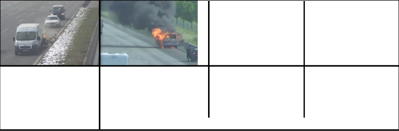
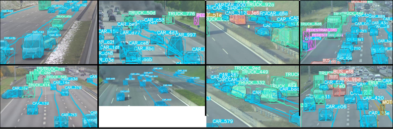

# AccidentDet3D: Automated Accident Detection for Roadside Sensors
<div align="center">
<a href="https://accident-dataset.github.io/"></a>
<a href=""></a>
<a href=""></a>
<a href="https://arxiv.org/pdf/0000.00000.pdf"></a>

<a href=""></a>
<a href="https://github.com/accident-dataset/AccidentDet3D/stargazers"></a>
<a href="https://github.com/accident-dataset/AccidentDet3D/network/members"></a>
<a href="https://github.com/accident-dataset/AccidentDet3D/pulls"></a>
<a href="https://github.com/accident-dataset/AccidentDet3D/issues"></a>
<a href=""></a>
</div>


<b>Visualization of the raw Accid3nD dataset.</b> Accidents are  recorded from roadside cameras on a test bed for autonomous driving. The dataset includes scenes with collisions and overturning vehicles. Some vehicles are catching fire.


# Abstract

The repository represents a framework for roadside sensors to automatically extract traffic scenarios like accidents, breakdowns, traffic jams and slow moving traffic. It can be applied to rosbag recordings that are recorded by roadside sensors. Depending on the arguments chosen, scenario statistics, scenario plots and images of detected events are automatically generated.


# Overview
- [Pipeline](#pipeline)
- [Features](#features)
- [Dataset](#dataset)
- [Quick Start](#quick-start)
- [Usage](#usage)
- [Output Structure](#output-structure)
- [Citation](#citation)
- [Further Information](#further-information)

## Pipeline

<b>Accident detection pipeline.</b> We use advanced 3D perception techniques and multi-sensor data fusion to create a real-time digital twin of the traffic. Starting with raw camera images, the framework first performs 3D object detection using MonoDet3D to identify and localize vehicle in three dimensions. Following detection, Poly-MOT tracking is applied to maintain continuity across frames, while sensor data fusion combines inputs from four roadside cameras and four radars. The digital twin then is used in two accident detection modules: 1) The <b>Rule-based Accident Detection</b> module extracts features such as lane IDs, distance matrices, and velocities, identifying potential accidents through predefined maneuver detection rules. 2) The <b>Learning-based Accident Detection</b> module employs a YOLOv8 object detector, trained on a custom dataset, to detect accident events. The final output includes the object's location, confidence score, class, velocity, and detected scenario or maneuver.


## Features
- [x] Artificial creation of driving scenarios (e.g. accidents or vehicle failures)
- [x] Scenario augmentation to create new samples from underrepresented scenario types (e.g. accidents)
- [x] Feature Extraction (lane ID, distance to leading and following vehicle, average velocity per frame)
- [x] Maneuver detection (e.g. accidents, breakdowns, standing vehicles, traffic jams etc.)
- [x] Creation of scenario statistics (includes e.g. number of detected accidents, breakdowns and traffic jams)
- [x] Generation of plots for detected scenarios
- [x] Creation of images of detected scenarions (e.g. accidents or breakdowns) 
- [x] Parsing extracted or synthetically generated driving scenarios into `OpenSCENARIO` format

## Dataset

<b>Visualization of the labeled Accid3nD dataset</b> with 3D box annotations, instance masks, track IDs, and trajectories. Accidents are recorded from roadside cameras on a test bed for autonomous driving. The dataset includes scenes with collisions and overturning vehicles. Some vehicles are catching fire.

## Quick Start

### Scenario Detection

##### 1. Clone repository
```shell
cd ~
git clone https://github.com/accident-dataset/accident-detection
mkdir -p ~/ros_ws/src
cd ~/ros_ws/src
ln -s ~/accident-detection
cd ~/accident-detection
```

##### 2. Create anaconda environment
```shell
conda env create -f environment.yml
```

##### 3. Install required python packages
```shell
conda install pytorch==1.12.1 torchvision==0.13.1 torchaudio==0.12.1 cudatoolkit=11.3 -c pytorch
pip install chardet
```

##### 4. Start roscore (in seperate terminal)
```shell
source /opt/ros/noetic/setup.bash
roscore
```

##### 5. Prepare execution of scenario detection
```shell
source /opt/ros/noetic/setup.bash
catkin_make
source devel/setup.bash
conda activate scenarios
```

##### 6. Start scenario detection
```shell
python src/scenario_detection_rosbag.py -i /home/input -o /home/output -s -pl -img accident
```

### Automated Accident Detection

Note: For the automated accident detection you need to must already have carried out the installation steps from the [scenario detection section](#scenario-detection), as the automated accident detection is based on the scenario detection.

##### 1. Install and create a tmux session (Optional)
```shell
sudo apt-get install tmux
tmux new -s <session_name>
```

##### 2. Start the Automated Accident Detection
```shell
bash src/detect_accidents.bash
```


## Usage
#### Scenario Detection
Detecting scenarios in a recording from the test stretch can be realized by:
```shell
python src/scenario_detection_rosbag.py -i <INPUT_FOLDER_PATH_ROSBAGS> -o <OUTPUT_FOLDER_PATH> -s -pl -img <EXTRACT_IMAGES_MODE> -adm <ACCIDENT_DETECTION_MODE>
```

Arguments for the scenario detection:
- `--frame_threshold`: number of consecutive frames in which an objects needs to be detected
- `-i <INPUT_FOLDER_PATH_ROSBAGS>`: input folder path to rosbags 
- `-o <OUTPUT_FOLDER_PATH>`: output folder path
- `-s`: generate statistic (as `.json` file)
- `-pl`: generate plots for statistics
- `-r`: append labels to rosbag file
- `-img <EXTRACT_IMAGES_MODE>`: Extract images of specified event (`standing_shoulder`, `accident`, `breakdown`, `accident_breakdown`)
- `-adm <ACCIDENT_DETECTION_MODE>`: Specify accident detection that should be used (`rule_based` or `ml`)

The parameters for the lane ID extraction, speeding and standing vehicles, breakdowns, traffic jams and accidents of the scenario detection can be found in `src/config.py`.


#### Automated Accident Detection
Detecting accidents and breakdowns in the recorded data from the cloud storage can be realized by:
```shell
bash src/detect_accidents.bash
```

Arguments for the automatic accident detection, which can be set in the script:
- `download_start`: defines the time, where the download and therefore scenario detection should start, e.g. `download_start="/year_2022/month_06/day_19"`
- `time_interval`: due to limited time, only rosbags during daytime were analyzed. from line 42 to 91 the times for which the rosbags should be analyzed can be set.


## Output structure
The output structure of the scenario detection for 4 rosbags is structured the following way as shown in below, if the scenario detection is executed with `-s`, `-pl` and `-img accident` arguments:

A rosbag, which contains an event specified in the image extraction gets its own folder, e.g. `rosbag_0` containing a folder for each event, e.g. `accident_0` with the images for all cameras. Additionally, the statistics and plots are stored in the folder of the rosbag. 
The statistics and plots for rosbags, which do not contain the event specified in the image extraction, are stored in a seperate `statistics` and `plots` folder.


``` 
├── output
│   ├── _rosbag_0
│   │   ├── accident_0
│   │   │   ├── s040_camera_basler_north_far_50mm
│   │   │   │   ├── image_0
│   │   │   │   ├── image_1
│   │   │   │   ├── image_2
│   │   │   ├── s040_camera_basler_north_near_16mm
│   │   │   │   ├── image_0
│   │   │   │   ├── image_1
│   │   │   │   ├── image_2
│   │   │   ├── s040_camera_basler_south_far_50mm
│   │   │   │   ├── image_0
│   │   │   │   ├── image_1
│   │   │   │   ├── image_2 
│   │   │   ├── s040_camera_basler_south_near_16mm
│   │   │   │   ├── image_0
│   │   │   │   ├── image_1
│   │   │   │   ├── image_2
│   │   ├── accident_1
│   │   │   ├── s040_camera_basler_north_far_50mm
│   │   │   │   ├── image_0
│   │   │   │   ├── image_1
│   │   │   │   ├── image_2
│   │   │   ├── s040_camera_basler_north_near_16mm
│   │   │   │   ├── image_0
│   │   │   │   ├── image_1
│   │   │   │   ├── image_2
│   │   │   ├── s040_camera_basler_south_far_50mm
│   │   │   │   ├── image_0
│   │   │   │   ├── image_1
│   │   │   │   ├── image_2
│   │   │   ├── s040_camera_basler_south_near_16mm
│   │   │   │   ├── image_0
│   │   │   │   ├── image_1
│   │   │   │   ├── image_2
│   │   ├── statistics_0.json
│   │   ├── plots_0.png
│   ├── _rosbag_3
│   │   ├── accident_0
│   │   │   ├── s040_camera_basler_north_far_50mm
│   │   │   │   ├── image_0
│   │   │   │   ├── image_1
│   │   │   │   ├── image_2
│   │   │   ├── s040_camera_basler_north_near_16mm
│   │   │   │   ├── image_0
│   │   │   │   ├── image_1
│   │   │   │   ├── image_2
│   │   │   ├── s040_camera_basler_south_far_50mm
│   │   │   │   ├── image_0
│   │   │   │   ├── image_1
│   │   │   │   ├── image_2
│   │   │   ├── s040_camera_basler_south_near_16mm
│   │   │   │   ├── image_0
│   │   │   │   ├── image_1
│   │   │   │   ├── image_2
│   │   ├── statistics_3.json
│   │   ├── plots_3.png
│   ├── _statistics
│   │   ├── statistics_1.json
│   │   ├── statistics_2.json
│   ├── _plots
│   │   ├── plots_1.png
│   │   ├── plots_2.png
```
